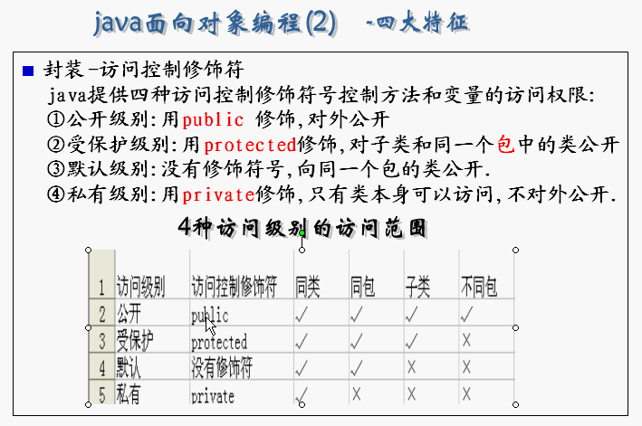

# java se学习知识点整理

---


## [JAVA常用的4种排序方法实现代码](src/main/java/cn/tekin/utils/sort)


- [java 快速排序法实现](src/main/java/cn/tekin/utils/sort/QuickSort.java)
- [java两路快排实现代码](src/main/java/cn/tekin/utils/sort/QuickSort2.java)
- [java三路快排实现代码](src/main/java/cn/tekin/utils/sort/QuickSort3.java)


- [java 二分查找法实现](src/main/java/cn/tekin/demo/TwoSplitFindDemo.java)


## JAVA学习资料

- [JAVA基础知识.pdf](docs/JAVA基础知识.pdf)

- [Java 面试知识点解析.pdf](docs/Java面试知识点解析.pdf)

- [JAVA中文乱码.doc](docs/JAVA中文乱码.doc)

- [常见数据结构.docx](docs/常见数据结构.docx)

- [常见算法基础题思路简析.doc](docs/常见算法基础题思路简析.doc)

- [几种常见排序算法.docx](docs/几种常见排序算法.docx)

- JAVA 修饰符



- [JAVA泛型](docs/JAVA泛型.md)


- [韩顺平java笔记完整版-基础篇](docs/韩顺平java笔记完整版/1-32基础)


# 练习Demo

- [JAVA算术运算，移位运算DEMO和详细运算过程讲解](src/main/java/Operation.java)

- [JAVA实现的雇员管理小程序](src/main/java/AssembleDemo2.java)

---
##数据类型

JAVA中的基本数据类型有四类八种：整数类型、小数类型、字符类型、布尔类型。

整数类型：byte、short、int、long

占用字节：  1　　   2　　4　　8

小数类型：float、double

占用字节：  4　　　8

字符类型：char

占用字节：  2

布尔类型：boolean

占用字节：布尔类型只有true或false理论上只占用1bit，所以按1byte处理。


JAVA从小到大排列顺序：byte、short、char、int、folat、long、double、boolean

JAVA中的引用数据类型有：类(class)、接口(interface)、数组([])。


## JAVA中的类型转换：

　　JAVA中的类型转换也有两种：一种是自动类型转换（隐式转换），另一种是强制类型转换（显示转换）。
　　　　自动类型转换：将一个数值A赋值给另一个数值B，如果A的类型小于B类型，系统会自动提升A的类型使他与B类型一致，然后再赋值给B


基本数据类型自动转换：


byte——》short、char——》int——》long

float——》double

int——》float

long——》double

　　　强制类型转换：将一个数值A赋值给另一个数值B，如果A的类型大于B类型，需要我们强制转换A的类型使他与B类型一致，然后再赋值给B
　　　　　　强制类型转换:需要注意的是强制类型转换可能会出现丢失精度的风险要慎用。

int a=10;

short b = (short)a;
 

JAVA中如何将字符串数值转换成数值类型。

String s = "123";

int num = Integer.parseInt(s);

利用基本类型的封装类的.parse……()方法来将字符串转换成相应的数值类型。　　　　　　


## JAVA中的运算符

### 1.算术运算符：用来进行一些数据算法的符号

- 算术运算符分为单目运算符、双目运算符、三目运算符。

- 单目运算符有：+（取正）-（取负）++（自增）--（自减）


- 双目运算符有：+（加）-（减）*（乘）/（除）%（取余）

- 三目运算符有：a>b?true:false判断a是否大于b如果大于b返回true也就是：前的值否则返回false（true和false）可以自己定义想要返回的值

### 2.关系运算符:用来判断数据比较关系的符号
- 关系运算符有：==（等于）！=（不等于）>（大于）<（小于）>=（大于等于）<=（小于等于）

### 3.逻辑运算符：用来判断数据逻辑关系的符号
- 逻辑运算符有：与（&&）或（||）非（！）

### 4.位运算符：用来对二进制位进行操作的符号（位运算比算术运算符效率高）
- 位运算符有：与（&）或（|）非（~）异或（^）<<（左移）>>（右移）>>>（无符号右移）

### 5.赋值运算符：用来赋值的运算符将右边的值赋给左边
- 赋值运算符有： =、+=、-=、*=、/=、%=、&=、|=、^=、<<=、>>=、>>>=


## Java中的循环：
1.while循环：符合条件执行循环不符合条件跳出循环

2.do—while循环:先执行一次循环，在判断条件是否符合，如果符合继续循环，不符合跳出循环

3.for循环:在明确循环次数时用for循环，判断条件是否符合，如果符合继续循环，不符合跳出循环

- while循环：
    
           /*
            * while语法：
            *     while(条件){
            *         执行体
            *     }
            * 
            * */

- do-while循环：

        /*
         * do-while语法：
         *     do{
         *         执行体
         *     }while(条件);
         * */
         
- for循环：
 
        /*
         * for语法：
         *     for(条件1；条件2；条件3){
         *         执行体
         *     }
         * */


##JAVA中的函数：

### 函数的定义：


函数就是定义在勒种具有独特功能的一段独立的小程序，函数也成为方法。

函数的格式：


访问修饰符 返回值类型 函数名（参数类型 形式参数1，参数类型 形式参数2，…………） {
    方法体;
    return 返回值;
}


访问修饰符：用来修饰函数的作用范围。

返回值类型：函数运行后的结果的数据类型。

参数类型：是形式参数的数据类型。

形式参数：是一个变量，用于存储调用函数时传递给函数的实际参数。

实际参数：传递给形式参数的具体数值。

return：用于结束函数。

返回值：该值会返回给调用者。
  
### 函数的特点：
  　　　　a) 定义函数可以将功能代码进行封装
  　　　　b) 便于对该功能进行复用
  　　　　c) 函数只有被调用才会被执行
  　　　　d) 函数的出现提高了代码的复用性
  　　　　e) 对于函数没有具体返回值的情况，返回值类型用关键字void表示，那么该函数中的return语句如果在最后一行可以省略不写，系统会帮你自动加上。
  　　　　注：
  　　　　a) 函数中只能调用函数，不可以在函数内部定义函数。
  　　　　b) 定义函数时，函数的结果应该返回给调用者，交由调用者处理。
  　　　　c) 当函数运算后，没有具体的返回值时，这是返回值类型用一个特殊的关键字来标识该关键字就是void，void：代表的是函数没有具体返回值的情况。
  　　　　d)  当函数的返回值类型是void时，函数中的return语句可以省略不写。
  　　如何定义一个函数：
  　　　　函数其实就是一个功能，定义函数就是实现功能，通过两个明确来完成：
        　　 1）、明确该功能的运算完的结果，其实是在明确这个函数的返回值类型。
        　　 2）、在实现该功能的过程中是否有未知内容参与了运算，其实就是在明确这个函数的参数列表(参数类型&参数个数)。
  　　函数的作用：
  　　　　1）、用于定义功能。
  　　　　2）、用于封装代码提高代码的复用性。
  　　　　注意：函数中只能调用函数，不能定义函数。
  　　为什么要定义函数的名称：
  　　　　1）、为了对该功能进行标示，方便于调用。
  　　　　2）、为了通过名称就可以明确函数的功能，为了增加代码的阅读性。
  　　主函数：
  　　　　1）、保证该类的独立运行。
  　　　　2）、因为它是程序的入口。
  　　　　3）、因为它在被jvm调用。
  　　函数的应用：
  　　　　1)  两个明确
  　　　　　　a)  明确要定义的功能最后的结果是什么？
  　　　　　　b)  明确在定义该功能的过程中，是否需要未知内容参与运算。


###函数的重载：

- 重载定义：函数名相同参数列表不同，与返回值类型无关。多态的一种
- 函数的重写：
    重写定义：子类重写父类的方法，方法名参数列表都相同。

##JAVA中的数组：
数组定义：用来存储同一类型的容器。数组中的数据类型类型必须是一致的。

###数组定义语法：

1.类型[] 数组名称 = new 类型[长度];


2.类型[] 数组名称 = new 类型[]{value1,value2,……};

- 获取数组按从大到小或从小到大排序：
```java
 int[] a = new int[]{5,10,20,30,1};
        for (int i = 0; i < a.length; i++) {
              for (int j = 0; j < a.length-1; j++) {//控制比较次数
                  int x=0;
                  if(a[i]>a[j]){
                      x = a[i];
                      a[i] = a[j];
                      a[j]=x;
                  }
             }
         }

```


## JAVA中的构造函数与this关键字
构造函数：构建创造对象时调用的函数
特点：
　　1.函数名与类名相同。
　　2.不用定义返回值类型。
　　3.没有具体的返回值。

作用：
　　给对象初始化，创建对象时会先调用构造方法对对象进行初始化。
注意：
　　1.默认构造函数的特点。不写构造函数时系统会自动给加一个默认的构造函数，如果自己 定义了一个构造函数，系统不会再给添加一个默认的构造函数。
　　2.多个构造函数是以重载的形式存在的。
　　3.创建对象都必须要通过构造函数初始化。

### 一般函数和构造函数的区别：

- 构造函数：
对象创建时，就会调用与之对应的构造函数，对对象进行初始化。
对象创建时，会调用且只调用一次 

- 一般函数：
对象创建后，需要函数功能是才调用。
对象创建后，可以调用多次。

- 什么时候定义构造函数： 在描述事物时，该事物一存在就具备一些内容，这些内容都定义在构造函数中。
 
 
 
### this关键字：
作用：

1.当成员变量和局部变量重名时，可以用this关键字来区分

2.当构造函数需要调用已有的构造函数时可以有this关键字，需要注意的是需要将调用的 构造函数放在第一行。

- this:

代表当前对象。

是所在函数所属对象的引用。

简单来说：哪个对象调用了this所在的函数，this就代表哪个对象。

##JAVA中的static关键字作用与用法
static关键字：
```html
特点：
　　1.static是一个修饰符，用于修饰成员。（成员变量，成员函数）static修饰的成员变量 称之为静态变量或类变量。
　　2.static修饰的成员被所有的对象共享。
　　3.static优先于对象存在，因为static的成员随着类的加载就已经存在。
　　4.static修饰的成员多了一种调用方式，可以直接被类名所调用，（类名.静态成员）。
　　5.static修饰的数据是共享数据，对象中的存储的是特有的数据。
成员变量和静态变量的区别：
　　1.生命周期的不同：
　　　　成员变量随着对象的创建而存在随着对象的回收而释放。
　　　　静态变量随着类的加载而存在随着类的消失而消失。
　　2.调用方式不同：
　　　　成员变量只能被对象调用。
　　　　静态变量可以被对象调用，也可以用类名调用。（推荐用类名调用）
　　3.别名不同：
　　　　成员变量也称为实例变量。
　　　　静态变量称为类变量。 
　　4.数据存储位置不同：
　　　　成员变量数据存储在堆内存的对象中，所以也叫对象的特有数据。
　　　　静态变量数据存储在方法区（共享数据区）的静态区，所以也叫对象的共享数据。

静态使用时需要注意的事项：
　　1.静态方法只能访问静态成员。（非静态既可以访问静态，又可以访问非静态）
　　2.静态方法中不可以使用this或者super关键字。
　　3.主函数是静态的。


什么时候使用static来修饰
　　1.静态变量：
　　　　当分析对象中所具备的成员变量的值都是相同的。这时这个成员就可以被静态修饰。
　　　　只要是数据在对象中都是不同的，就是对象的特有数据，必须存储在对象中，是非静态的。 
　　　　如果是相同的数据，对象不需要做修改，只需要使用即可，不需要存储在对象中，是静态的。

　　2.静态函数。
　　　　函数是否用静态修饰，就参考一点，就是该函数功能是否有访问到对象中特有的数据。
　　　　简单来说，从源代码看，该功能是否需要访问非静态的成员变量，如果需要，该功能就是非静态的。如果不需要，就可以将该功能定义成静态的。当然，也可以定义成非静态，但是非静态需要被对象调用，而仅创建对象是没有意义的。

静态代码块：
　　随着类的调用或创建实例而执行，而且只执行一次。
作用：
　　用于给类进行初始化。


```


## JAVA中的静态代码块、构造代码块、构造函数、局部代码块区别

```html
构造代码块：
　　在类中定义可以给所有对象进行初始化。
局部代码块：
　　在方法中定义属性的生命周期。
静态代码块：
　　在类中定义用于给类调用时属性的初始化
构造函数与构造代码块的区别：
　　构造函数是给对应的对象进行针对性的初始化。
　　构造代码块是给所有对象进行初始化

public class Demo {
    private static  int age;
    private static  String name;
    //静态代码块：给类的属性进行初始化
    static{
        age = 10;
        name = "旺财";
    }
    //构造代码块：给所有的对象初始化定义在类中方法外。
    {
        show();
    }
    public Demo(int age,String name){//有参构造函数
        Demo.age =age;
        Demo.name = name;
    }
    public Demo(){//无参构造函数
        
    }
    public void show(){ //普通函数
        //局部代码块：定义属性的生命周期
        {
            char sex = '男';//变量sex出了{}后就会被销毁
            System.out.println("sex="+sex);
        }
        Demo.name = "张三";
    }
    public static void main(String[] args) {
        /*当有静态代码块构造代码块构造函数时程序执行流程
         * 1.类被调用或创建实例时会执行静态代码块进行初始化执行后age=10 name=旺财。
         * 2.创建实例会执行构造代码块调用show方法执行后sex = 男 ，age不变，name = 张三。
         * 3.调用有参构造函数传入参数执行后age = 50，name=姚明。
         * 执行顺序为：
         * 1、静态代码块 :给类的属性进行初始化。
         * 2、构造代码块:给所有的对象进行初始化。
         * 3、有参或无惨构造（根据实例来定）：给指定的对象进行初始化。
         * 结果为：sex=男 注意这个是在构造代码块中输出的
         *          50    姚明
         * */
        Demo d = new Demo(50,"姚明");
        System.out.println(d.age+"\t"+d.name);
    }
}


```


## HashMap和Hashtable 的区别

```html

一.HashMap 和Hashtable 的区别
　　我们先看2个类的定义
``` 
```java
public class Hashtable  
     extends Dictionary  
     implements Map, Cloneable, java.io.Serializable 
public class HashMap  
    extends AbstractMap  
    implements Map, Cloneable, Serializable  
　　可见Hashtable 继承自 Dictiionary 而 HashMap继承自AbstractMap
　　Hashtable的put方法如下
 
public synchronized V put(K key, V value) {  //###### 注意这里1  
  // Make sure the value is not null  
  if (value == null) { //###### 注意这里 2  
    throw new NullPointerException();  
  }  
  // Makes sure the key is not already in the hashtable.  
  Entry tab[] = table;  
  int hash = key.hashCode(); //###### 注意这里 3  
  int index = (hash & 0x7FFFFFFF) % tab.length;  
  for (Entry e = tab[index]; e != null; e = e.next) {  
    if ((e.hash == hash) && e.key.equals(key)) {  
      V old = e.value;  
      e.value = value;  
      return old;  
    }  
  }  
  modCount++;  
  if (count >= threshold) {  
    // Rehash the table if the threshold is exceeded  
    rehash();  
    tab = table;  
    index = (hash & 0x7FFFFFFF) % tab.length;  
  }  
  // Creates the new entry.  
  Entry e = tab[index];  
  tab[index] = new Entry(hash, key, value, e);  
  count++;  
  return null;  
} 
```
 
注意1 方法是同步的

注意2 方法不允许value==null

注意3 方法调用了key的hashCode方法，如果key==null,会抛出空指针异常 HashMap的put方法如下

```java

public V put(K key, V value) { //###### 注意这里 1  
  if (key == null)  //###### 注意这里 2  
    return putForNullKey(value);  
  int hash = hash(key.hashCode());  
  int i = indexFor(hash, table.length);  
  for (Entry e = table[i]; e != null; e = e.next) {  
    Object k;  
    if (e.hash == hash && ((k = e.key) == key || key.equals(k))) {  
      V oldValue = e.value;  
      e.value = value;  
      e.recordAccess(this);  
      return oldValue;  
    }  
  }  
  modCount++;  
  addEntry(hash, key, value, i);  //###### 注意这里   
  return null;  
}  
 
```

注意1 方法是非同步的

注意2 方法允许key==null

注意3 方法并没有对value进行任何调用，所以允许为null

补充： 
　　Hashtable 有一个 contains方法，容易引起误会，所以在HashMap里面已经去掉了
当然，2个类都用containsKey和containsValue方法。


  名称 | 父类 | 是否同步 | 是否可为空
---- | --- | ---  | --- 
HashMap | AbstractMap | 否 |  是
Hashtable | Dictiionary | 是 | 否


HashMap是Hashtable的轻量级实现（非线程安全的实现），他们都完成了Map接口，

主要区别在于HashMap允许空（null）键值（key）,由于非线程安全，效率上可能高于Hashtable。
 
 
HashMap允许将null作为一个entry的key或者value，而Hashtable不允许。
 
 
HashMap把Hashtable的contains方法去掉了，改成containsvalue和containsKey。因为contains方法容易让人引起误解。 
 
Hashtable继承自Dictionary类，而HashMap是Java1.2引进的Map interface的一个实现。
 
 

最大的不同是，Hashtable的方法是Synchronize的，而HashMap不是，在多个线程访问Hashtable时，不需要自己为它的方法实现同步，而HashMap 就必须为之提供外同步(Collections.synchronizedMap)。 
 

Hashtable和HashMap采用的hash/rehash算法都大概一样，所以性能不会有很大的差异。
 

- 总结：

HashMap中键值 允许为空 并且是非同步的

Hashtable中键值 不允许为空 是同步的

继承不同，但都实现了Map接口


# 常用集合框架
ArrayList
HashMap
HashTable
LinkedList
Vector
Stack
Iterator

List结构集合类
ArrayList， LinkedList, Vector, Stack

Map结构集合类
HashMap
HashTable

Set结构集合类
HashSet
TreeSet

Queue队列结构的集合类
Queue接口

 
## JAVA中 == 比较的是引用地址是否相等，  equals() 比较的是值是否相等

如
```java

    String a=new String("abc");
    String b=new String("abc");
    if(a==b) {
        System.out.println("ok!");
    }else{
        System.out.println(" fail ");
    }
    
//结果  fail

if(a.equals(b)) System.out.println("ok!");
    //结果OK
    
```


[Tekin](http://tekin.yunnan.ws)